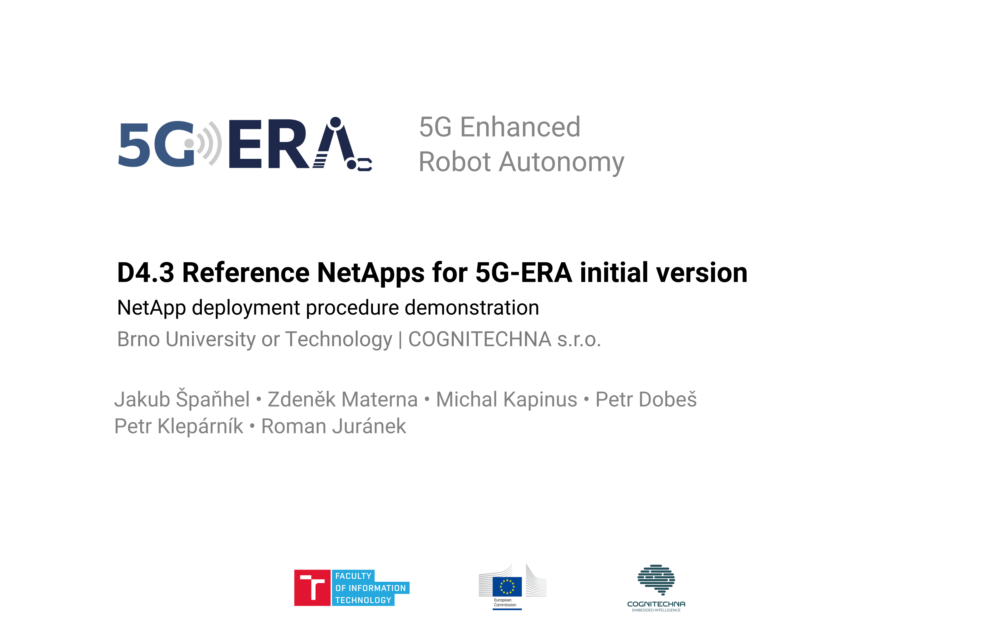

# 5G-ERA Reference NetApp

This repository contains the reference NetApp implementation with MMCV detector in both standalone and distributed variant, together with reference robot implementation example. Besides, reference kubernetes deployment files and Dockerfiles are presented in coresponding folders.

Step-by-step guides for reference robot intergation is [here](src/ros2/era_5g_robot/README.md).

## Demonstration video
Video demonstration of reference robot communicating with 5G-ERA Middleware and Reference NetApp is available here:

## Related Repositories

- [era-5g-interface](https://github.com/5G-ERA/era-5g-interface) - Python interface (support classes) for Net Applications.
- [era-5g-client](https://github.com/5G-ERA/era-5g-client) - client classes for 5G-ERA NetApps with various transport options.
